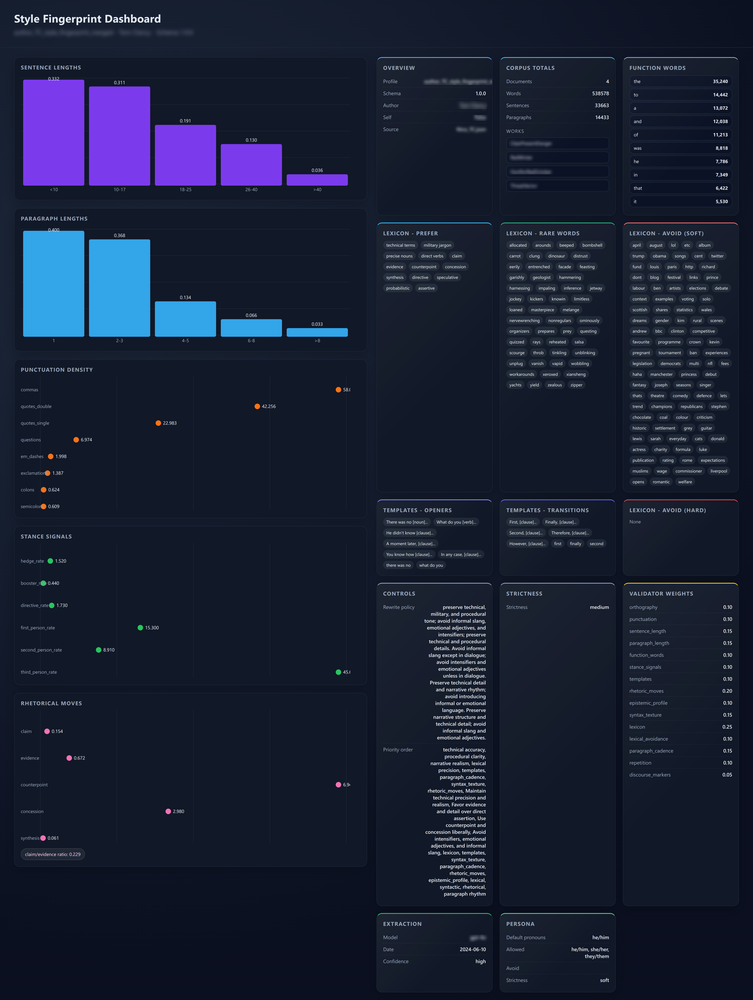

# stylometric-transfer

> **Stylometric profiling + controllable author-style transfer for personal writing**

`stylometric-transfer` constructs an explicit, interpretable **stylometric style profile** from an author’s corpus, then applies that profile to rewrite or generate new text in the same voice.

In practical terms, the system enables an LLM to apply a specified writing style to any text input. It performs stylometric profiling and humanization on writing samples, then uses constraint-guided author-style transfer for a target document. A style "fingerprint" is built from the writing corpus using classic stylometric measurements and graph structure, and that fingerprint is applied via an LLM to rewrite any text.

Comments are encouraged.

Further details are available in `Article-Teaching-Machines-to-Write-Like-You.md` and `Research-Paper.md`.

<p align="center">
  
  <br/>
  <em>An example fingerprint (output from show_fingerprint.py)</em>
</p>


This repository includes:
- `fingerprint_style.py`: extracts a **style fingerprint (stylometric profile)** from a writing archive
- `apply_fingerprint.py`: rewrites Markdown to match the fingerprint
- `show_fingerprint.py`: generates a standalone HTML dashboard for a fingerprint JSON
- `prompts.json`: externalized prompt templates used by both scripts (edit here to adjust behaviour)
- `scripts/`: bash wrappers for invoking the Python entry points

Unlike fine-tuning or opaque embeddings, the system uses an **explicit, versionable JSON style model** that can be inspected, edited, audited, and reused.
A **humanization-aware conflict-resolution layer** integrates humanizer guidelines directly into the rewrite step, without violating the fingerprint’s style constraints.

---
## License

PolyForm Noncommercial License 1.0.0. This project is licensed under the **PolyForm Noncommercial License 1.0.0** (see `LICENSE.md`).

**Key points (plain English):**
- **Noncommercial only**: Use, modification, and redistribution are permitted for **noncommercial purposes**.
- **Commercial use requires permission**: Any **commercial** use (including paid products or services incorporating this code) requires **explicit permission from the author**.
- **Attribution required**: Redistribution or use of substantial portions of this project must include **clear credit** and preserve the license/notice requirements described in `LICENSE.md`.

For commercial use, contact the author to discuss licensing.

---
## Table of Contents

- [Overview](#overview)
- [Concepts & Terminology](#concepts--terminology)
- [Features](#features)
- [Architecture](#architecture)
- [Installation](#installation)
- [Configuration](#configuration)
- [Usage](#usage)
  - [1. Build a Style Fingerprint](#1-build-a-style-fingerprint)
  - [2. Apply a Fingerprint](#2-apply-a-fingerprint)
- [Output Files](#output-files)
- [Testing](#testing)
- [Style Model Schema](#style-model-schema)
- [Ethics & Intended Use](#ethics--intended-use)
- [Roadmap](#roadmap)
- [References](#references)

---

## Overview

The project implements a two-stage pipeline:

1. **Stylometric profiling**  
   Quantitative analysis of an author’s corpus to construct a structured **style fingerprint** (JSON)

2. **Author-conditioned style transfer**  
   Rewriting new text to conform to that fingerprint while preserving meaning

The system integrates:
- Local statistical measurement (sentence length, punctuation rates, paragraph structure, etc.)
- LLM-based synthesis into an explicit style model
- Constraint-driven rewriting using that model

This is a practical implementation of:

> **Stylometric profiling + controlled author-style transfer**

---

## Concepts & Terminology

| Term | Meaning |
|------|---------|
| **Stylometry** | Quantitative analysis of writing style (measurable signals, not semantics). |
| **Stylometric profile** | A feature-based summary of an author’s style derived from a corpus. |
| **Style fingerprint** | The explicit JSON artifact that encodes style measurements, targets, and controls. |
| **Style transfer** | Rewriting text to match a fingerprint while preserving meaning. |
| **Author‑conditioned generation** | Generating new text guided by a fingerprint rather than a raw prompt alone. |
| **Measurements** | Observed statistics from the corpus (e.g., sentence length histograms, punctuation rates). |
| **Targets** | Desired ranges or qualitative goals derived from measurements (used in rewriting). |
| **Lexicon** | Preferred/avoided words and phrases; soft or hard constraints. |
| **Templates** | Rhetorical or syntactic patterns (openers, transitions, paragraph moves). |
| **Controls** | Priority/strictness and rewrite policies that govern tradeoffs. |
| **Validators** | Checks and weights used to score compliance or detect deviations. |
| **Deviations** | Structured report of where the model could not comply or had to adjust. |
| **Control normalization** | Deterministic de‑duplication of `rewrite_policy` clauses and token filtering for `priority_order`. |
| **Humanizer rules** | General guidelines (from `general-guidelines.md`) filtered for conflicts with the fingerprint. |
| **Tunables** | Runtime configuration (`config.tunables.json`) that shapes filtering, retries, chunking, and metrics. |
| **Entity blacklist** | Names/places/orgs list used to suppress proper‑name phrases during phrase validation. |
| **Lexical avoidance list** | Common words the author rarely uses (treated as soft avoids). |
| **Fiction vs non‑fiction** | Classification that determines whether multi‑word quotes are rewritten or preserved. |
| **Chunking** | Splitting large inputs to fit the model context, then reconciling outputs. |
| **Style retry** | Optional delta‑feedback loop that re‑prompts if compliance score is low. |
| **Humanization metrics** | Quantitative, research‑grounded signals used to score “human‑likeness.” |

In research terms, the system performs:
- Feature-based stylometric profiling from real corpus statistics
- Interpretable, constraint‑driven rewriting/generation
- Conflict‑aware humanization aligned with explicit style constraints

---

## Features

- Accepts `.zip` / `.tar*` archives of writing corpora
- Reads `.txt`, `.md`, `.rst`, `.html`, `.docx` (via `python-docx`)
- Computes statistical measurements locally:
  - Sentence length distributions
  - Paragraph structure
  - Punctuation rates
  - Contraction and dash usage
  - US vs Canadian spelling heuristic (English-only)
  - Common n-grams
  - Function-word profile and stance signals (hedging/boosting/pronouns)
  - Sentence-opener and transition templates (top patterns)
  - Rare-word signals (words the author rarely uses)
  - One-sentence paragraph rate / paragraph rhythm
  - Rhetorical move rates (claim/evidence/counterpoint/concession/synthesis)
  - Paragraph cadence (opening/closing sentence length stats)
  - Epistemic stance bands (speculative/probabilistic/assertive/directive)
  - Syntax texture (subordinate/parenthetical/appositive rates)
  - Discourse marker positions (start vs mid-sentence)
  - Repetition signals (bigram/trigram repeat rates)
- Produces a **comprehensive JSON style profile**
- Rewrites Markdown with:
  - Meaning preservation
  - Structural fidelity
  - Deviation reporting
  - Optional style-compliance retry with delta feedback
  - Deterministic normalization of verbose rewrite policies and noisy priority orders before use
- Filters out blockquotes, reference sections, footnotes, citation markers, and boilerplate notices (copyright/terms/privacy) from style measurements and excerpts, preserving them verbatim during rewrite
- Strips embedded BASE64 images before sending prompts to the LLM and re-embeds them in output
- Compatible with OpenAI (works with OpenAI, Azure OpenAI, vLLM, etc.)
- Interpretable, editable, versionable style models

---

## Architecture

```
corpus.tar.gz
      │
      ▼
[fingerprint_style.py]
      │
      ├─ local statistical analysis
      ├─ representative excerpts
      └─ LLM synthesis
      │
      ▼
style_fingerprint.json
      │
      ▼
[apply_fingerprint.py]
      │
      ├─ local measurement of input
      ├─ constraint-driven rewriting
      └─ deviation audit
      │
      ▼
rewritten_text.styled.md
```

---

## Installation

### Requirements

- Python 3.9+
- `requests`
- `python-docx` (optional, for `.docx` corpora)

```bash
pip install requests python-docx
```

---

## Configuration

Create `config.llm.json` in the project root (used by default):

```json
{
  "api_key": "YOUR_OPENAI_KEY",
  "base_url": "https://api.openai.com/v1",
  "model": "gpt-4.1-mini",
  "max_tokens": 6000,
  "max_prompt_tokens": 6000,
  "temperature": 0.2,
  "timeout_seconds": 300,
  "max_retries": 6,
  "backoff_base_seconds": 2.0,
  "backoff_max_seconds": 20.0
}
```

Notes:
- Default lookup for `config.llm.json`: current working directory first, then the directory containing the Python scripts
- `config.tunables.json` can override humanizer conflict thresholds (same search path as config.llm.json)
- `max_prompt_tokens` controls chunking for large inputs (defaults to `max_tokens`; override per run with `--max-prompt-tokens`)
- `max_retries`, `backoff_base_seconds`, and `backoff_max_seconds` control exponential backoff retries for transient LLM errors or timeouts
- `base_url` should be the API root (no `/chat/completions`)
- Any OpenAI-compatible endpoint can be used
- Lower temperature is recommended for consistency
- Prompt templates are stored in `prompts.json` next to the Python scripts and are loaded at runtime (includes the `validate_phrases` template used for common-phrase validation)
- Optional `lexicon_hints.json` (in repo root or next to the scripts) can provide preferred or avoided phrases for fingerprinting
- Optional `config.avoid.txt` (in repo root or next to the scripts) lists words or phrases to always avoid; it is merged into the fingerprint lexicon and enforced during style application
- Optional `config.common_words.txt` (in repo root or next to the scripts) defines the common‑word list used to derive `measurements.lexical_avoidance.rare_words` (words common in English but absent from the corpus). Format: `word <zipf_frequency>`; the frequency is optional but used to prioritize higher‑frequency words first.
- Optional `config.entity_blacklist.txt` (in repo root or next to the scripts) lists entities (people, places, organizations) to suppress from common-phrase extraction to avoid proper‑name dominance
- Genre handling: by default the tools auto-detect fiction vs non-fiction; override with `--fiction` or `--non-fiction`. In non-fiction, multi-word quotations are excluded from fingerprinting and preserved verbatim during rewriting.
- When fingerprinting, the current `config.tunables.json` can be embedded as `metadata.extraction.tunables_snapshot` for auditability
- If the fingerprint prompt exceeds `max_prompt_tokens`, excerpts are chunked and **partial fingerprints are merged using a second LLM merge pass** (pairwise merge with a dedicated merge prompt).
- Common-phrase validation now includes a deterministic prefilter (honorifics + capitalization‑ratio heuristics, entity blacklist, date patterns) and an optional LLM phrase‑ranking step that drops likely proper‑name phrases before final selection.
- Rare‑word selection can be ranked by the same LLM validation call used for common phrases, to de‑prioritize proper names before truncation.
- **Corpus size guidance:** diminishing returns typically appear once core style statistics stabilize. As a rule of thumb, ~20–50k words often yields a stable fingerprint for a single author/genre; ~100k words usually captures most steady signals. If key rates (sentence/paragraph distributions, punctuation per 1k words, function‑word profile, stance rates) drift by <1–2% after adding another 10–20k words, you’re likely in the diminishing‑returns zone. More data still helps when you’re mixing genres/eras or chasing rare rhetorical/lexical signals.

### Tunables: `config.tunables.json`

`apply_fingerprint.py` uses `config.tunables.json` to determine which humanizer guidelines conflict with the fingerprint or the input Markdown style. Any rule that conflicts is dropped before prompting. `fingerprint_style.py` can also embed a `tunables_snapshot` under `metadata.extraction` to preserve the exact tunables used during profile creation.

Example (defaults shown):

```json
{
  "humanizer_conflicts": {
    "em_dash_keep_rate": 0.5,
    "hedge_keep_rate": 1.0,
    "first_person_keep_rate": 0.5,
    "contractions_avoid_threshold": 2.0,
    "contractions_use_threshold": 0.5,
    "heading_title_case_keep_rate": 0.6,
    "boldface_keep_per_1000w": 3.0,
    "inline_header_list_keep_rate": 0.2
  },
  "humanizer_mandatory": {
    "avoid_em_dashes": true,
    "emoji_policy": "replace"
  },
  "humanizer_variance": {
    "enabled": true,
    "seed": 12345,
    "max_ops_per_1000w": 0.5,
    "allowed_ops": ["swap_transition", "drop_filler"]
  },
  "humanization_metrics": {
    "weights": {
      "lexical_diversity": 1.0,
      "herdan_c": 1.0,
      "guiraud_r": 1.0,
      "maas_ttr_inverse": 1.0,
      "yules_k_inverse": 1.0,
      "simpson_d_inverse": 1.0,
      "repetition_inverse": 1.0,
      "sentence_burstiness": 1.0,
      "paragraph_burstiness": 1.0,
      "punctuation_variety": 1.0,
      "punctuation_entropy": 1.0,
      "function_word_entropy": 1.0,
      "function_word_kl_inverse": 1.0,
      "sentence_length_js_inverse": 1.0,
      "char_trigram_entropy": 1.0,
      "avg_word_length": 1.0
    }
  },
  "humanization_baseline": {
    "enabled": true,
    "window_words": 800,
    "stride_words": 400,
    "min_window_words": 250,
    "max_windows": 200
  },
  "humanization_controller": {
    "enabled": true,
    "seed": 12345,
    "quantiles": [0.25, 0.5, 0.75],
    "range_pct": 0.15,
    "min_width": 0.05,
    "max_width": 6.0,
    "allowed_metrics": [
      "sentence_length_mean",
      "sentence_length_stdev",
      "one_sentence_paragraph_rate",
      "comma_density_per_100w",
      "punctuation_semicolons_per_1000w",
      "punctuation_colons_per_1000w",
      "punctuation_em_dashes_per_1000w"
    ],
    "feedback_enabled": true,
    "feedback_tolerance": 0.35,
    "max_feedback_retries": 2
  },
  "lexical_signals": {
    "rare_words_limit": 100
  },
  "lexical_avoidance": {
    "rare_words_limit": 100
  },
  "controls_normalization": {
    "rewrite_policy": {
      "jaccard_threshold": 0.7,
      "dedupe_on_subset": true,
      "prefer_more_specific": true,
      "compress_directives": true,
      "directive_verbs": [
        "preserve",
        "avoid",
        "maintain",
        "ensure",
        "keep",
        "favor",
        "use",
        "prefer",
        "minimize",
        "maximize",
        "do not",
        "don't"
      ],
      "stopwords": [
        "the",
        "and",
        "of",
        "to",
        "a",
        "an",
        "in",
        "on",
        "for",
        "with",
        "or",
        "but",
        "as",
        "by",
        "from",
        "into",
        "at",
        "that",
        "this",
        "these",
        "those",
        "be",
        "is",
        "are",
        "was",
        "were",
        "been",
        "being"
      ]
    },
    "priority_order": {
      "token_pattern": "^[A-Za-z][A-Za-z0-9_\\-]*$",
      "dedupe_case_insensitive": true,
      "exclude_tokens": ["lexical", "syntactic", "rhetorical"]
    }
  },
  "fiction_detection": {
    "quote_span_min": 6,
    "quoted_ratio_min": 0.03,
    "quote_para_ratio_min": 0.2,
    "quoted_ratio_force": 0.08
  },
  "chunking": {
    "max_input_tokens": 6000,
    "chunk_split_on": "sentence",
    "min_chunks_when_perturbing": 2,
    "recovery_split_max_depth": 2,
    "recovery_split_min_chars": 800,
    "variance_aware": {
      "enabled": true,
      "sentence_stdev_ref": 18.0,
      "paragraph_burst_ref": 0.7,
      "min_factor": 0.6,
      "max_factor": 1.0
    }
  },
  "style_retry": {
    "enabled": true,
    "threshold": 0.75,
    "max_retries": 2
  },
  "section_restore": {
    "enabled": true,
    "max_restore_sections": 20,
    "heading_similarity_threshold": 0.5,
    "signature_similarity_threshold": 0.35,
    "signature_min_overlap": 6
  },
  "sanity_checks": {
    "line_count_warn_pct": 10.0,
    "word_count_warn_pct": 10.0,
    "paragraph_count_warn_pct": 10.0
  }
}
```

**Explanation of each tunable**
- `em_dash_keep_rate` (per 1000 words): if the fingerprint’s em-dash rate is **at or above** this value, the “avoid em dashes” guideline is considered conflicting and removed.
- `hedge_keep_rate` (per 1000 words): if the fingerprint’s hedging rate is **at or above** this value, “avoid hedging” guidance is dropped.
- `first_person_keep_rate` (per 1000 words): if the fingerprint’s first-person rate is **below** this value (or pronoun preferences avoid first-person), “use I/first-person” guidance is dropped.
- `contractions_avoid_threshold` (per 1000 words): if the fingerprint’s contraction rate is **at or above** this value, any “avoid contractions” guideline is dropped.
- `contractions_use_threshold` (per 1000 words): if the fingerprint’s contraction rate is **below** this value, any “use contractions” guideline is dropped.
- `heading_title_case_keep_rate` (0–1): if the input Markdown’s headings are **mostly Title Case** (ratio at or above this value), the “avoid Title Case” guideline is dropped.
- `boldface_keep_per_1000w` (per 1000 words): if the input uses boldface **at or above** this density, “avoid boldface” guidance is dropped.
- `inline_header_list_keep_rate` (0–1): if the input uses inline-header list style (e.g., `- **Label:** text`) **at or above** this ratio, the “avoid inline-header lists” guideline is dropped.
- `avoid_em_dashes` (boolean): when true, em‑dashes are always removed in the output regardless of other signals.
- `emoji_policy` (`remove`, `replace`, or `none`): remove emojis, replace common ones with conventional monochrome symbols, or disable emoji handling.
- `humanizer_variance.enabled` (boolean): enables bounded stochastic micro‑variation during application.
- `humanizer_variance.seed` (integer): RNG seed for deterministic runs.
- `humanizer_variance.max_ops_per_1000w` (float): maximum number of micro‑operations per 1000 words. **Recommendation:** start at `0.5`; `0.5–1.5` is usually safe. Values above `2.0` can begin to feel noisy unless the input is highly repetitive.
- `humanizer_variance.allowed_ops` (array): allowed micro‑operations (e.g., `swap_transition`, `drop_filler`). **Recommendation:** begin with `["swap_transition", "drop_filler"]`, add ops gradually, and keep the list short to avoid compounding randomness.
  - `swap_transition`: swaps a transition phrase with another compatible transition to vary surface rhythm without changing meaning.
  - `drop_filler`: removes low‑information filler words/phrases when safe (bounded by the ops budget).
- `humanization_metrics.weights` (object): optional weighting for the 0–100 aggregate humanization score. Any metric with a weight of 0 is excluded.
- `humanization_baseline.enabled` (boolean): when true, fingerprinting computes rolling “within-author variability” baselines (stored under `measurements.humanization_baseline`). These baselines are for auditability/controller logic and are stripped from what the LLM sees during rewriting.
- `humanization_baseline.window_words` (integer): rolling window size (in words) used to compute baseline variability stats.
- `humanization_baseline.stride_words` (integer): stride size (in words) between windows.
- `humanization_baseline.min_window_words` (integer): minimum usable window size; if a window is smaller, baseline computation stops early.
- `humanization_baseline.max_windows` (integer): cap on how many windows are computed (keeps runtime bounded on very large corpora).
- `humanization_controller.enabled` (boolean): enables per‑chunk target overlays derived from the baseline (embedded in fingerprint, stripped from LLM prompt except as derived overlay targets).
- `humanization_controller.seed` (integer): deterministic seed for overlay sampling.
- `humanization_controller.quantiles` (array of 0–1): which baseline quantiles are eligible when sampling per‑chunk targets (e.g., `[0.25, 0.5, 0.75]`).
- `humanization_controller.range_pct` (float): width of the target range around the sampled value (percentage of the value).
- `humanization_controller.min_width` (float): minimum absolute width for a target range.
- `humanization_controller.max_width` (float): maximum absolute width for a target range.
- `humanization_controller.allowed_metrics` (array): which overlay metrics are used (e.g., `sentence_length_mean`, `sentence_length_stdev`, `one_sentence_paragraph_rate`, `comma_density_per_100w`, `punctuation_semicolons_per_1000w`).
- `humanization_controller.feedback_enabled` (boolean): when true, style retry feedback includes overlay‑mismatch guidance.
- `humanization_controller.feedback_tolerance` (float): how far outside the overlay range the output must be before controller feedback is added (fraction of range).
- `humanization_controller.max_feedback_retries` (integer): cap on how many retries will include controller feedback.
- `lexical_signals.rare_words_limit` (integer): maximum number of rare words to include in `measurements.lexical_signals.rare_words`.
- `lexical_avoidance.rare_words_limit` (integer): maximum number of absent common words (from `config.common_words.txt`) to include in `measurements.lexical_avoidance.rare_words`.
- `controls_normalization.rewrite_policy.jaccard_threshold` (0–1): similarity threshold for considering two rewrite-policy clauses duplicates (lower = more aggressive de‑dup).
- `controls_normalization.rewrite_policy.dedupe_on_subset` (boolean): treat clauses as duplicates when one clause is a strict subset of another.
- `controls_normalization.rewrite_policy.prefer_more_specific` (boolean): when near-duplicates are found, keep the clause with more unique tokens.
- `controls_normalization.rewrite_policy.compress_directives` (boolean): merge repeated `preserve`/`avoid` directives into a smaller number of interpretable clauses (reduces redundancy and token overhead).
- `controls_normalization.rewrite_policy.directive_verbs` (array): verbs that mark the start of new rewrite-policy clauses.
- `controls_normalization.rewrite_policy.stopwords` (array): stopwords ignored when comparing clauses for de‑duplication.
- `controls_normalization.priority_order.token_pattern` (regex string): which items are allowed to survive normalization (default keeps short token‑like priorities only).
- `controls_normalization.priority_order.dedupe_case_insensitive` (boolean): de‑dup priorities ignoring case.
- `controls_normalization.priority_order.exclude_tokens` (array): drop these token‑like entries even if they match the regex (the pipeline also drops generic `lexical`, `syntactic`, and `rhetorical` tokens by default).
- `fiction_detection.quote_span_min` (integer): minimum multi‑word quote spans required before classifying as fiction (lower = more likely fiction).
- `fiction_detection.quoted_ratio_min` (float 0–1): minimum fraction of words inside multi‑word quotes to classify as fiction (lower = more likely fiction).
- `fiction_detection.quote_para_ratio_min` (float 0–1): minimum fraction of paragraphs starting with a quote to classify as fiction (lower = more likely fiction).
- `fiction_detection.quoted_ratio_force` (float 0–1): if quoted word ratio exceeds this, force fiction regardless of other signals.
- `chunking.max_input_tokens` (integer): hard cap on input tokens per chunk (after prompt overhead). Lower values increase chunk count but reduce per‑request latency and timeouts.
- `chunking.chunk_split_on` (`word`, `sentence`, or `paragraph`): primary unit for chunking. `sentence` is default. If a paragraph exceeds the token budget, it falls back to sentence splitting for that chunk; if a single sentence is still too long, it falls back to word splitting just for that chunk. Bullet/numbered list lines are treated as sentence units even without terminal punctuation.
- `chunking.min_chunks_when_perturbing` (integer): enforce a minimum number of chunks when perturbations are enabled (humanizer variance or controller overlays), so variability has room to express.
- `chunking.recovery_split_max_depth` (integer): when the LLM repeatedly returns invalid output for a chunk, this controls how many recursive recovery splits may be attempted.
- `chunking.recovery_split_min_chars` (integer): minimum chunk size (in characters) before attempting recovery splitting; smaller chunks are preserved verbatim instead.
- `chunking.variance_aware.enabled` (boolean): when true, chunk sizes are scaled based on baseline variability (higher variance → smaller chunks).
- `chunking.variance_aware.sentence_stdev_ref` (float): reference sentence-length stdev for scaling.
- `chunking.variance_aware.paragraph_burst_ref` (float): reference paragraph burstiness for scaling.
- `chunking.variance_aware.min_factor` (float): minimum multiplier applied to `max_input_tokens` when variance is high.
- `chunking.variance_aware.max_factor` (float): maximum multiplier applied to `max_input_tokens` when variance is low.
- `style_retry.enabled` (boolean): enable/disable the delta‑feedback retry pass after measuring style compliance.
- `style_retry.threshold` (0–1): retry when compliance score is below this threshold (default `0.75`). Lower values trigger fewer retries (more permissive); higher values trigger more retries (stricter). `0.0` effectively disables threshold-based retries, while `1.0` retries unless the output is nearly perfect.
- `style_retry.max_retries` (integer): maximum number of retry passes (default `2`).
- `section_restore.enabled` (boolean): enable/disable restoration of missing sections detected after rewriting.
- `section_restore.max_restore_sections` (integer): maximum number of missing sections to restore (0 disables restoration).
- `section_restore.heading_similarity_threshold` (0–1): fuzzy heading match threshold for considering a rewritten heading “present”.
- `section_restore.signature_similarity_threshold` (0–1): content‑signature similarity threshold for matching a section by its opening content.
- `section_restore.signature_min_overlap` (integer): minimum number of overlapping signature tokens required for a content match.
- `line_count_warn_pct` (%): if the output line count changes by this percentage or more, a console warning is emitted to review for missing or expanded content.
- `word_count_warn_pct` (%): if the output word count changes by this percentage or more, a console warning is emitted to review for missing or expanded content.
- `paragraph_count_warn_pct` (%): if the output paragraph count changes by this percentage or more, a console warning is emitted to review for missing or expanded content.

All thresholds are conservative defaults. Lowering a threshold increases the likelihood of a conflict (more rules dropped). Raising a threshold makes the humanizer rules more permissive.

---

### Global avoid list: `config.avoid.txt`

If present, `config.avoid.txt` provides a hard “never use” list. Each non-empty line is treated as a word or short phrase to avoid. Lines may include comments after `#`, and blank lines are ignored. The list is:

- Injected into fingerprinting as hard lexicon avoids
- Merged into `lexicon.avoid_words` during application (even if the fingerprint does not include them)

Organizational bans, regulatory requirements or personal preferences may take precedence over the author's stylistic choices.

The algorithmic common‑word omissions from `config.common_words.txt` populate `lexicon.avoid_words_soft` instead (soft guidance).

---

### Entity blacklist: `config.entity_blacklist.txt`

If present, `config.entity_blacklist.txt` provides a list of entity names (people, places, organizations) that should be excluded from common-phrase extraction. This helps prevent proper‑name phrases (e.g., “new york”, “microsoft”, “jane doe”) from dominating `common_phrases`. Lines may include comments after `#`, and blank lines are ignored. Multi-word names are supported. Single-word names shorter than 3 characters are ignored.

---

## Usage

### 1. Building a Style Fingerprint

Begin by creating a compressed archive of your writing corpus:

```bash
tar -czf my_corpus.tar.gz essays/ notes/ drafts/
```

Fingerprinting is performed as follows:

```bash
python fingerprint_style.py \
  -a my_corpus.tar.gz \
  -o my_fingerprint.json \
  --profile-id "me_style_v1" \
  --author-name "Me"
```

Alternatively, use the wrapper script:

```bash
./scripts/fingerprint_style.sh \
  -a my_corpus.tar.gz \
  -o my_fingerprint.json \
  --profile-id "me_style_v1" \
  --author-name "Me"
```

To specify a non-default configuration path, pass `-c/--config`. If `--profile-id` or `--author-name` are not provided, they default to the output filename without the `.json` extension (for example, `my_fingerprint`). Progress logging is enabled with `-v/--verbose`.

By default, common phrases are validated using an additional LLM pass to filter out OCR errors and citation fragments. This can be disabled via `--no-phrase-validation`.

Large corpora are automatically chunked according to `max_prompt_tokens`; override this with `--max-prompt-tokens`.

The process will:
- Extract the archive
- Measure stylistic statistics (excluding blockquotes, reference sections, footnotes, boilerplate notices, and inline citations)
- Send measurements and excerpts to the LLM
- Produce `my_fingerprint.json`

---

### 2. Applying a Fingerprint

To rewrite a Markdown file in your style:

```bash
python apply_fingerprint.py \
  -f my_fingerprint.json \
  -i draft.md
```

Alternatively, use the wrapper script:

```bash
./scripts/apply_fingerprint.sh \
  -f my_fingerprint.json \
  -i draft.md
```

Specify a non-default configuration path with `-c/--config`. Progress logging is enabled with `-v/--verbose`. `-f/--fingerprint` appends `.json` if no extension is given. Long inputs are chunked automatically based on `max_prompt_tokens`; override this with `--max-prompt-tokens`.

Style compliance is scored locally. If the score falls below the threshold, the system retries once by default and produces a delta report (disable with `--no-style-retry`, adjust with `--style-retry-threshold` or `--max-style-retries`).

If `general-guidelines.md` is present in the repository root or next to the scripts, its humanization rules (adapted from softaworks/agent-toolkit by @leonardocouy) are parsed with an LLM by default. Deterministically conflicting guidance (based on fingerprint signals such as em-dash rate, hedging or first-person use) is dropped before prompting. This introduces one additional LLM call when enabled. Parsed rules are cached in `humanizer_rules.cache.json` next to the scripts and are only re-parsed when `general-guidelines.md` changes. LLM parsing can be disabled via `--no-humanizer-llm-parse`, or the guidelines can be disabled entirely via `--no-humanizer-guidelines`.

Pronoun override flags let you force the narrative voice regardless of the fingerprint: `--1st-person`, `--2nd-person`, or `--3rd-person`.

Embedded BASE64 images are removed from prompts to avoid excessive token usage and re-inserted into the rewritten output.
Blockquotes, reference sections, footnotes, boilerplate notices, and inline citations are preserved verbatim and excluded from style transfer.

Outputs:
- `draft.md.styled.md`: rewritten text
- `draft.md.styled.md.deviations.json`: any rule conflicts or deviations
  - When `--metrics` is enabled, includes `humanization_metrics` for **both input and output**, with heuristic quantitative scores plus an aggregate 0–100 score (`aggregate_score_100`).
  - Metrics include: lexical diversity (TTR, Herdan’s C, Guiraud’s R, Maas TTR), Yule’s K, Simpson’s D, repetition inverse, sentence/paragraph burstiness, punctuation variety/entropy, function‑word entropy and KL‑inverse vs fingerprint, sentence‑length JS‑inverse vs fingerprint, character trigram entropy, and average word length.

---

### Visualize a Fingerprint

Generate an HTML dashboard to review key fingerprint settings and measurements:

```bash
python show_fingerprint.py path/to/fingerprint.json -o fingerprint_dashboard.html
```

Use `--open` to launch the dashboard in your browser.

Wrapper script (can be called from anywhere):

```bash
./scripts/show_fingerprint.sh path/to/fingerprint.json -o fingerprint_dashboard.html --open
```

---

## Output Files

### Style Fingerprint (`*.json`)

Contents include:
- `metadata`: corpus and extraction information
  - `metadata.corpus.document_count`: number of corpus documents
- `metadata.corpus.documents`: per-document metadata (path, title when available, size, language/locale, genres, time range)
- `measurements`: raw statistical signals (including `orthography_signals.spelling_variant`, paragraph rhythm, `lexical_signals.rare_words`, and `lexical_avoidance.rare_words` derived from a built-in common-words list)
- `targets`: stylistic constraints and distributions (including optional persona pronoun preferences)
- `lexicon`: preferred and avoided words and phrases (`avoid_words` = hard avoids, `avoid_words_soft` = soft avoids)
- `templates`: syntactic and rhetorical patterns
- `controls`: strictness, priority ordering, and optional humanizer variance (seeded, bounded micro‑variation)
- `validators`: scoring weights and checks
- `derived_instructions`: compiled prompts for generation and rewriting

This file is human readable, editable, version controllable and reusable across projects.

---

## Testing

Lightweight smoke tests are located in `tests/` and exercise the full pipeline using small fixtures. These tests call the LLM and require a valid `config.llm.json`.

To run the smoke test:

```bash
./tests/run_smoke.sh
```

Artifacts are written to `tests/_artifacts/` (gitignored).

The v1.1.0 regression suite (no API calls) is found in `tests/test_v1_1_0_regression.py` and is automatically executed by `run_smoke.sh`. It can also be run directly:

```bash
./tests/run_v1_1_0_regression.sh
```

The v1.5.x regression suite (no API calls) is found in `tests/test_v1_5_X_regression.py` and is also executed by `run_smoke.sh`:

```bash
./tests/run_v1_5_X_regression.sh
```

The v1.7.x regression suite (no API calls) is found in `tests/test_v1_7_X_regression.py` and is also executed by `run_smoke.sh`:

```bash
./tests/run_v1_7_X_regression.sh
```

An LLM connectivity check is also run by `run_smoke.sh` via `tests/test_llm_smoke.py` (uses the same `config.llm.json`); it is skipped when the endpoint is unreachable.

---

## Style Model Schema

The schema models several layers:
- Orthography and formatting
- Punctuation signature
- Sentence rhythm and clause structure
- Paragraph architecture
- Lexical preferences
- Semantic tendencies
- Rhetorical moves
- Persona and stance (including pronoun preferences)

Supported features include:
- Target values with tolerance ranges
- Histograms rather than single averages
- Hard versus soft constraints
- Priority-ordered enforcement

This enables interpretable, controllable generation rather than opaque imitation.

---

## Ethics and Intended Use

The project is intended for:
- Personal writing consistency
- Author self-modelling
- Editing assistance
- Long-term voice preservation

It is not intended for:
- Impersonating living authors without consent
- Passing generated text off as another person
- Circumventing authorship or attribution

Recommended practice:
- Use only your own writing or licensed/public-domain corpora
- Set `do_not_imitate_living_author = true` in controls
- Clearly label AI-assisted outputs when appropriate

---

## Roadmap

Planned extensions:
- [ ] JSON Schema validation (`jsonschema`)
- [ ] HTML / PDF corpus ingestion
- [ ] Streaming and retry/backoff support
- [ ] Style similarity scoring CLI
- [ ] Batch rewriting
- [ ] Fine-grained constraint toggles
- [ ] Visualisation of stylistic distributions

---

## References

Core research areas:

- Stylometry / computational stylistics  
- Authorship attribution  
- Text style transfer  
- Interpretable controllable generation  

Representative terms:

- *Stylometric profiling*  
- *Author‑conditioned text generation*  
- *Feature‑based style modeling*  
- *Constraint‑augmented rewriting*

---

## Acknowledgments

Inspired by:
- Stylometric authorship research
- Controllable text generation literature
- Practical needs for long-term personal voice consistency

---

*stylometric-transfer: explicit style models for interpretable author voice transfer*
