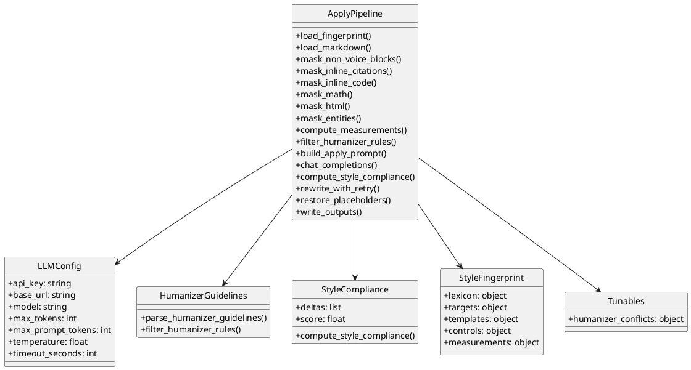
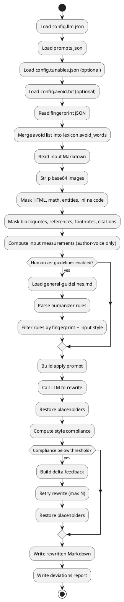
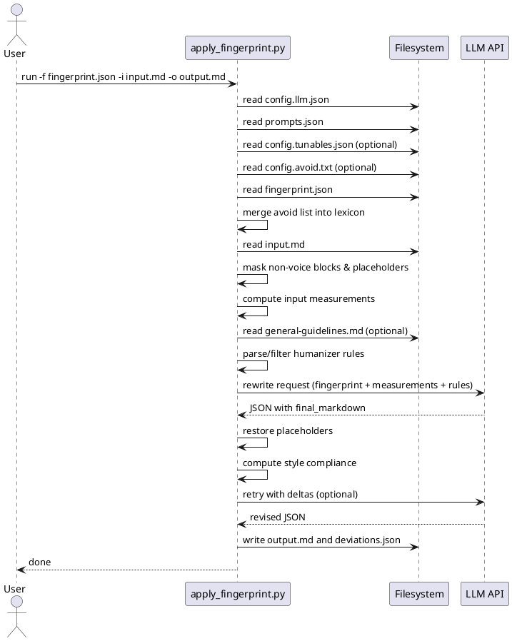

# UML: Apply Pipeline

This document contains PlantUML Class, Activity, and Sequence diagrams for the apply pipeline.

## Class Diagram

```plantuml
@startuml
skinparam style strictuml
skinparam classAttributeIconSize 0

class LLMConfig {
  +api_key: string
  +base_url: string
  +model: string
  +max_tokens: int
  +max_prompt_tokens: int
  +temperature: float
  +timeout_seconds: int
}

class ApplyPipeline {
  +load_fingerprint()
  +load_markdown()
  +mask_non_voice_blocks()
  +mask_inline_citations()
  +mask_inline_code()
  +mask_math()
  +mask_html()
  +mask_entities()
  +compute_measurements()
  +filter_humanizer_rules()
  +build_apply_prompt()
  +chat_completions()
  +compute_style_compliance()
  +rewrite_with_retry()
  +restore_placeholders()
  +write_outputs()
}

class HumanizerGuidelines {
  +parse_humanizer_guidelines()
  +filter_humanizer_rules()
}

class StyleCompliance {
  +compute_style_compliance()
  +deltas: list
  +score: float
}

class StyleFingerprint {
  +lexicon: object
  +targets: object
  +templates: object
  +controls: object
  +measurements: object
}

class Tunables {
  +humanizer_conflicts: object
}

ApplyPipeline --> LLMConfig
ApplyPipeline --> StyleFingerprint
ApplyPipeline --> HumanizerGuidelines
ApplyPipeline --> StyleCompliance
ApplyPipeline --> Tunables
@enduml
```

## Activity Diagram

```plantuml
@startuml
start
:Load config.llm.json;
:Load prompts.json;
:Load config.tunables.json (optional);
:Load config.avoid.txt (optional);

:Read fingerprint JSON;
:Merge avoid list into lexicon.avoid_words;
:Read input Markdown;

:Strip base64 images;
:Mask HTML, math, entities, inline code;
:Mask blockquotes, references, footnotes, citations;

:Compute input measurements (author-voice only);

if (Humanizer guidelines enabled?) then (yes)
  :Load general-guidelines.md;
  :Parse humanizer rules;
  :Filter rules by fingerprint + input style;
endif

:Build apply prompt;
:Call LLM to rewrite;
:Restore placeholders;
:Compute style compliance;

if (Compliance below threshold?) then (yes)
  :Build delta feedback;
  :Retry rewrite (max N);
  :Restore placeholders;
endif

:Write rewritten Markdown;
:Write deviations report;
stop
@enduml
```

## Sequence Diagram

```plantuml
@startuml
actor User
participant "apply_fingerprint.py" as AF
participant "Filesystem" as FS
participant "LLM API" as LLM

User -> AF : run -f fingerprint.json -i input.md -o output.md
AF -> FS : read config.llm.json
AF -> FS : read prompts.json
AF -> FS : read config.tunables.json (optional)
AF -> FS : read config.avoid.txt (optional)
AF -> FS : read fingerprint.json
AF -> AF : merge avoid list into lexicon
AF -> FS : read input.md
AF -> AF : mask non-voice blocks & placeholders
AF -> AF : compute input measurements
AF -> FS : read general-guidelines.md (optional)
AF -> AF : parse/filter humanizer rules
AF -> LLM : rewrite request (fingerprint + measurements + rules)
LLM --> AF : JSON with final_markdown
AF -> AF : restore placeholders
AF -> AF : compute style compliance
AF -> LLM : retry with deltas (optional)
LLM --> AF : revised JSON
AF -> FS : write output.md and deviations.json
AF --> User : done
@enduml
```

