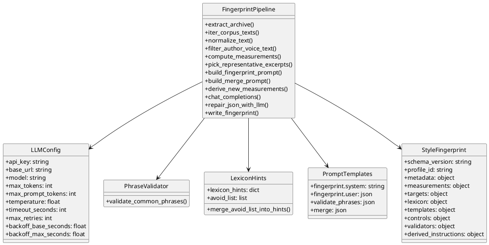
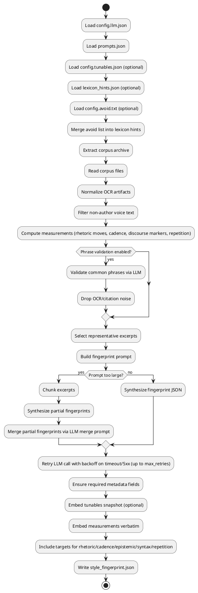
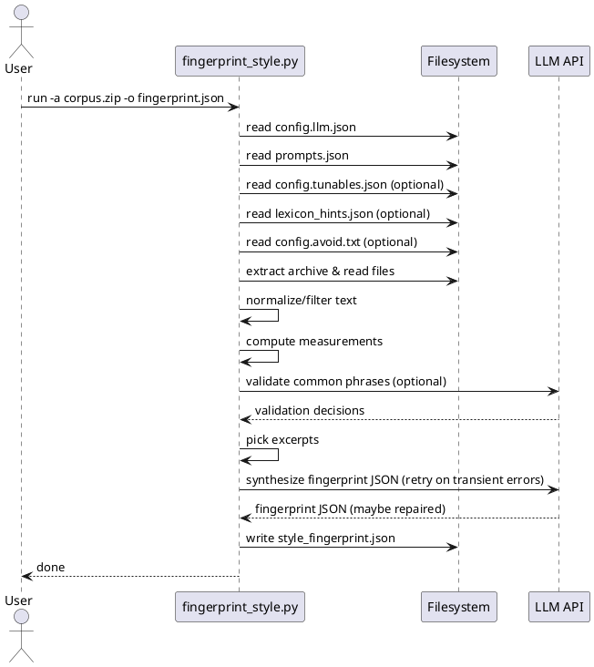

# UML: Fingerprint Pipeline

This document contains PlantUML Class, Activity, and Sequence diagrams for the fingerprinting pipeline.

## Class Diagram

```plantuml
@startuml
skinparam style strictuml
skinparam classAttributeIconSize 0

class LLMConfig {
  +api_key: string
  +base_url: string
  +model: string
  +max_tokens: int
  +max_prompt_tokens: int
  +temperature: float
  +timeout_seconds: int
  +max_retries: int
  +backoff_base_seconds: float
  +backoff_max_seconds: float
}

class FingerprintPipeline {
  +extract_archive()
  +iter_corpus_texts()
  +normalize_text()
  +filter_author_voice_text()
  +compute_measurements()
  +pick_representative_excerpts()
  +build_fingerprint_prompt()
  +build_merge_prompt()
  +derive_new_measurements()
  +chat_completions()
  +repair_json_with_llm()
  +write_fingerprint()
}

class PhraseValidator {
  +validate_common_phrases()
}

class LexiconHints {
  +lexicon_hints: dict
  +avoid_list: list
  +merge_avoid_list_into_hints()
}

class PromptTemplates {
  +fingerprint.system: string
  +fingerprint.user: json
  +validate_phrases: json
  +merge: json
}

class StyleFingerprint {
  +schema_version: string
  +profile_id: string
  +metadata: object
  +measurements: object
  +targets: object
  +lexicon: object
  +templates: object
  +controls: object
  +validators: object
  +derived_instructions: object
}

FingerprintPipeline --> LLMConfig
FingerprintPipeline --> PromptTemplates
FingerprintPipeline --> PhraseValidator
FingerprintPipeline --> LexiconHints
FingerprintPipeline --> StyleFingerprint
@enduml
```

## Activity Diagram

```plantuml
@startuml
start
:Load config.llm.json;
:Load prompts.json;
:Load config.tunables.json (optional);
:Load lexicon_hints.json (optional);
:Load config.avoid.txt (optional);
:Merge avoid list into lexicon hints;

:Extract corpus archive;
:Read corpus files;
:Normalize OCR artifacts;
:Filter non-author voice text;
:Compute measurements (rhetoric moves, cadence, discourse markers, repetition);

if (Phrase validation enabled?) then (yes)
  :Validate common phrases via LLM;
  :Drop OCR/citation noise;
endif

:Select representative excerpts;
:Build fingerprint prompt;

if (Prompt too large?) then (yes)
  :Chunk excerpts;
  :Synthesize partial fingerprints;
  :Merge partial fingerprints via LLM merge prompt;
else (no)
  :Synthesize fingerprint JSON;
endif

:Retry LLM call with backoff on timeout/5xx (up to max_retries);

:Ensure required metadata fields;
:Embed tunables snapshot (optional);
:Embed measurements verbatim;
:Include targets for rhetoric/cadence/epistemic/syntax/repetition;
:Write style_fingerprint.json;
stop
@enduml
```

## Sequence Diagram

```plantuml
@startuml
actor User
participant "fingerprint_style.py" as FS
participant "Filesystem" as FSYS
participant "LLM API" as LLM

User -> FS : run -a corpus.zip -o fingerprint.json
FS -> FSYS : read config.llm.json
FS -> FSYS : read prompts.json
FS -> FSYS : read config.tunables.json (optional)
FS -> FSYS : read lexicon_hints.json (optional)
FS -> FSYS : read config.avoid.txt (optional)
FS -> FSYS : extract archive & read files
FS -> FS : normalize/filter text
FS -> FS : compute measurements
FS -> LLM : validate common phrases (optional)
LLM --> FS : validation decisions
FS -> FS : pick excerpts
FS -> LLM : synthesize fingerprint JSON (retry on transient errors)
LLM --> FS : fingerprint JSON (maybe repaired)
FS -> FSYS : write style_fingerprint.json
FS --> User : done
@enduml
```
